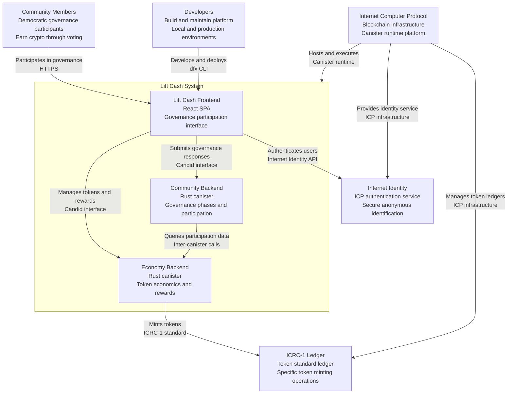
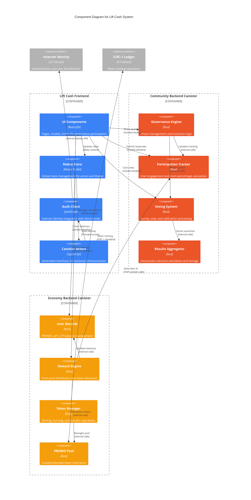
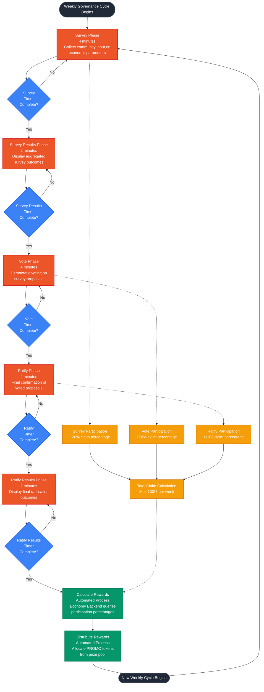
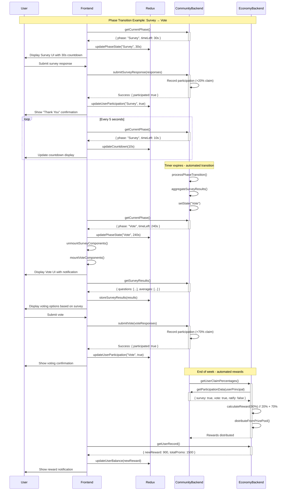
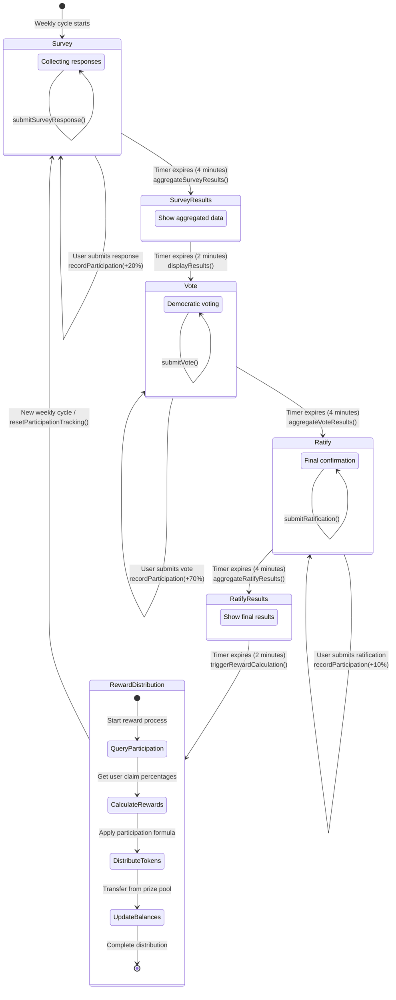
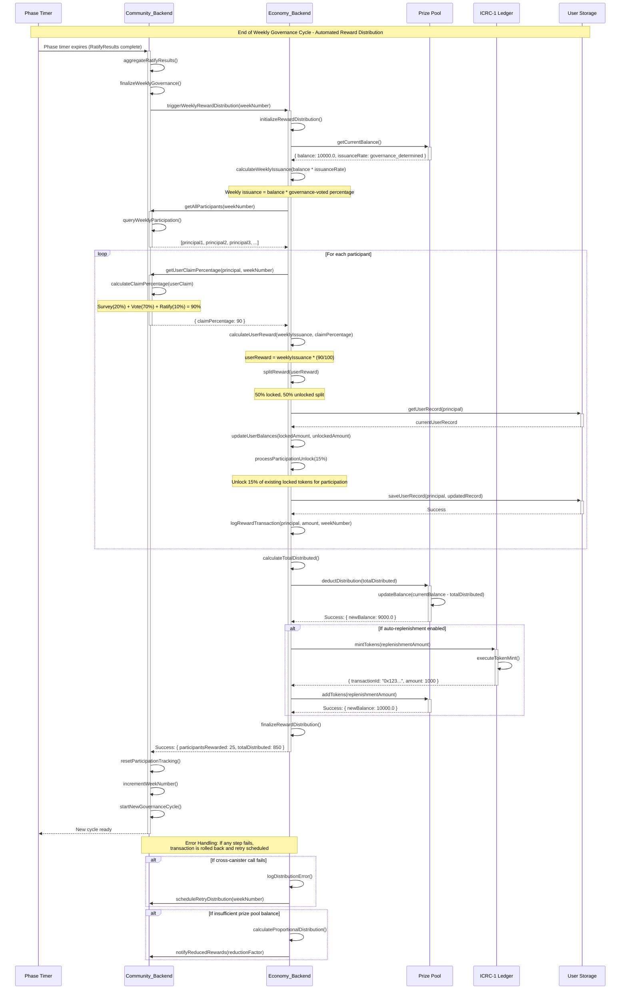
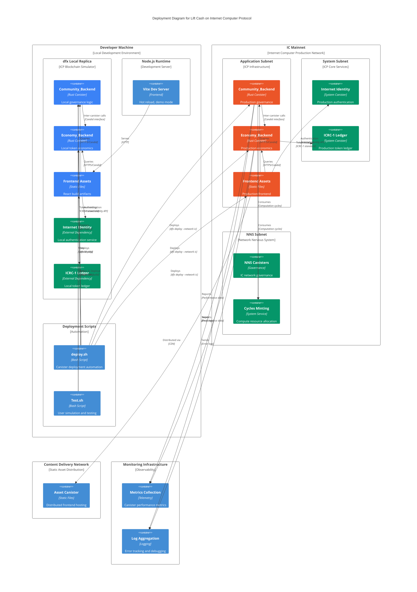

# Lift Cash System Architecture

## High-Level Architectural Overview

Lift Cash is a **self-governed, cooperative economic system** built on the Internet Computer Protocol (ICP) blockchain that enables participants to democratically manage fiscal policy and earn crypto income through governance participation.

### System Architecture Summary

The system follows a **multi-canister architecture** with clear separation of concerns:

- **Community_Backend (Rust)**: Manages democratic governance workflows, phase transitions, and user participation tracking
- **Economy_Backend (Rust)**: Handles financial records, token economics, reward distribution, and cross-canister balance management
- **Lift_Cash_frontend (React/TypeScript)**: Provides user interface with Redux state management, Internet Identity authentication, and real-time governance participation

### Core Components and Responsibilities

#### 1. Community_Backend Canister
- **Governance Lifecycle Management**: Orchestrates weekly governance cycles (Survey → Vote → Ratify → Results)
- **Participation Tracking**: Records user engagement with claim percentages (Survey: 20%, Vote: 70%, Ratify: 10%)
- **Democratic Decision-Making**: Aggregates community input using averages for sliders and majority votes for choices
- **Phase Transition Logic**: Automated 4-minute phases with 2-minute result periods

#### 2. Economy_Backend Canister
- **Financial Record Management**: Maintains user balances for PROMO, LIFT, and ICP tokens
- **Token Economics**: Implements 50/50 locked/unlocked PROMO mechanism with 15% unlock per participation
- **Reward Distribution**: Distributes from prize pool (10,000 tokens) based on governance participation
- **Cross-Canister Integration**: Calls Community_Backend to retrieve user claim percentages for reward calculations

#### 3. React Frontend
- **State Management**: Redux Toolkit with actorsSlice (canister connections) and themeSlice (dark mode)
- **Authentication**: Internet Identity integration with configurable demo mode for development
- **Real-time Updates**: Live phase transitions with countdown timers and dynamic UI updates
- **Responsive Design**: Mobile-first Tailwind CSS with custom CSS variables for consistent theming

### System Interactions

#### Inter-Canister Communication Flow
1. **Frontend ↔ Community_Backend**: Submit governance responses, fetch phase status and participation data
2. **Frontend ↔ Economy_Backend**: Retrieve financial records, initiate token operations, check reward eligibility
3. **Economy_Backend → Community_Backend**: Query user participation percentages for automated reward distribution

#### Governance Workflow
```
Weekly Cycle: Survey (4min) → SurveyResults (2min) → Vote (4min) → Ratify (4min) → RatifyResults (2min) → Reward Distribution → New Week
```

#### Development Modes
- **Demo Mode** (`DEMO_MODE = true`): Frontend-only development with mock authentication and canister actors
- **Full Mode** (`DEMO_MODE = false`): Complete ICP integration with real canisters and blockchain operations

### Token Economics Architecture

#### Three-Token System
- **PROMO**: Primary reward token with locking mechanism (50% locked initially, unlocks based on participation)
- **LIFT**: Governance and utility token for system operations
- **ICP**: Native Internet Computer token for ecosystem integration

#### Token Implementation Architecture
- **PROMO Token**: Internal balance system only (NOT ICRC-1 compliant)
  - Stored as `f64` fields in Economy_Backend user records
  - Managed through internal canister functions
  - Supports complex locking/unlocking mechanics for governance participation
  - No external blockchain token standard integration
- **LIFT Token**: Full ICRC-1 compliant blockchain token
  - Complete ICRC-1/ICRC-2 ledger canister deployment with standard functionality
  - Internal balance tracking in user records for system operations and performance
  - External ICRC-1 ledger canister ID: `ss2fx-dyaaa-aaaar-qacoq-cai`
  - Supports standard wallet integration, user-to-user transfers, and all ICRC operations
- **ICP Token**: External blockchain token with standard ICP wallet integration

#### Economic Mechanics
- **Prize Pool Management**: 10,000 token pool with governance-determined weekly issuance percentage
- **Participation Rewards**: Proportional distribution based on governance engagement levels
- **Automated Distribution**: Cross-canister reward calculation and token transfer after each cycle

#### Token Operations Integration
- **ICRC-1 Integration**: Limited scope - used only for specific token minting operations via hardcoded ledger canister (ss2fx-dyaaa-aaaar-qacoq-cai)
- **Internal Balance System**: Main reward distribution and token transfers handled through Economy Backend's internal balance management
- **Multi-Token Support**: PROMO, LIFT, and ICP token balances maintained within the canister state

## Prototype Phase Mermaid UML Diagrams

Based on the system architecture analysis, the following Mermaid diagrams would be most effective for explaining the Lift Cash system to new developers and stakeholders:

### 1. System Architecture Diagrams

#### **C4 Context Diagram**
- **Purpose**: Show high-level system boundaries and external actors
- **Content**: Users, Internet Identity, ICP blockchain, external systems, and the Lift Cash system boundary
- **Audience**: Executive stakeholders, product managers, system architects



#### **Component Diagram**
- **Purpose**: Illustrate major system components and their relationships
- **Content**: Frontend, Community_Backend, Economy_Backend, and their interfaces
- **Audience**: Technical architects, senior developers



### 2. Governance Process Diagrams

#### **Flowchart: Governance Lifecycle**
- **Purpose**: Visualize the complete governance workflow from Survey to Results
- **Content**: Phase transitions, decision points, and automated processes
- **Audience**: Product owners, governance participants, business stakeholders



#### **Sequence Diagram: Phase Transition Flow**
- **Purpose**: Show time-based interactions during phase transitions
- **Content**: Frontend polling, canister state changes, and user notifications
- **Audience**: Frontend developers, backend developers



#### **State Diagram: Governance Phase States**
- **Purpose**: Illustrate valid phase transitions and system states
- **Content**: Survey, Vote, Ratify, Results states with transition conditions
- **Audience**: Backend developers, QA engineers



### 3. Data and Integration Diagrams

#### **Entity Relationship Diagram: Data Model**
- **Purpose**: Show data structures and relationships between entities
- **Content**: UserRecord, PhaseData, GovernanceResults, and their relationships
- **Audience**: Backend developers, database designers, data analysts

```mermaid
erDiagram
    %% Community Backend Entities
    VOTING_SYSTEM {
        u64 current_week PK
        u64 last_week
        u64 iteration_count
        u64 last_stage_timestamp
        Phase current_phase
    }
    
    USER_CLAIM {
        Principal user_principal PK
        u64 week_number PK
        bool has_surveyed
        bool has_voted
        bool has_ratified
        u8 claim_percentage
    }
    
    SURVEY_RESPONSE {
        Principal user_principal PK
        string question_id PK
        SurveyResponseType response_type
        string response_value
    }
    
    VOTE_RESPONSE {
        Principal user_principal PK
        string question_id PK
        u8 percentage_vote
    }
    
    RATIFICATION_RESPONSE {
        Principal user_principal PK
        u64 week_number PK
        bool approved
    }
    
    WEEKLY_SURVEY_RESULTS {
        u64 week_number PK
        string question_id PK
        string aggregated_result
        string result_type
    }
    
    WEEKLY_VOTE_RESULTS {
        u64 week_number PK
        string question_id PK
        u8 average_vote
        u64 participant_count
    }
    
    WEEKLY_RATIFICATION_COUNTS {
        u64 week_number PK
        string result_key PK
        u64 count_value
    }
    
    %% Economy Backend Entities
    USER_RECORD {
        Principal user_principal PK
        f64 total_promo
        f64 locked_promo
        f64 unlocked_promo
        f64 lift_token_balance
        f64 last_week_reward
        f64 icp_balance
    }
    
    BURN_HISTORY {
        Principal user_principal PK
        u64 burn_id PK
        f64 amount_burned
        u64 timestamp
    }
    
    PRIZE_POOL {
        string pool_id PK
        f64 current_balance
        f64 initial_balance
        f64 weekly_issuance_percentage
    }
    
    %% Cross-Canister Reference Entity
    PRINCIPAL_USER_MAPPING {
        Principal user_principal PK
        string user_id
        u64 registration_timestamp
    }
    
    %% Governance Phase State
    STATE {
        Phase current_phase PK
        u64 phase_start_time
        u64 remaining_time
        string phase_description
    }
    
    %% Relationships
    VOTING_SYSTEM ||--o{ USER_CLAIM : "tracks weekly participation"
    VOTING_SYSTEM ||--o{ WEEKLY_SURVEY_RESULTS : "aggregates by week"
    VOTING_SYSTEM ||--o{ WEEKLY_VOTE_RESULTS : "aggregates by week"
    VOTING_SYSTEM ||--o{ WEEKLY_RATIFICATION_COUNTS : "aggregates by week"
    
    USER_CLAIM ||--|| PRINCIPAL_USER_MAPPING : "identified by principal"
    USER_CLAIM ||--o{ SURVEY_RESPONSE : "participation tracking"
    USER_CLAIM ||--o{ VOTE_RESPONSE : "participation tracking"
    USER_CLAIM ||--o{ RATIFICATION_RESPONSE : "participation tracking"
    
    SURVEY_RESPONSE }o--|| WEEKLY_SURVEY_RESULTS : "aggregated into"
    VOTE_RESPONSE }o--|| WEEKLY_VOTE_RESULTS : "aggregated into"
    RATIFICATION_RESPONSE }o--|| WEEKLY_RATIFICATION_COUNTS : "aggregated into"
    
    %% Cross-canister relationships
    USER_CLAIM ||--|| USER_RECORD : "determines rewards for"
    PRINCIPAL_USER_MAPPING ||--|| USER_RECORD : "financial data for"
    USER_RECORD ||--o{ BURN_HISTORY : "tracks token burns"
    
    PRIZE_POOL ||--o{ USER_RECORD : "distributes rewards to"
    
    VOTING_SYSTEM ||--|| STATE : "maintains phase state"
    
    %% Temporal relationships
    WEEKLY_SURVEY_RESULTS ||--|| WEEKLY_VOTE_RESULTS : "survey results feed voting"
    WEEKLY_VOTE_RESULTS ||--|| WEEKLY_RATIFICATION_COUNTS : "vote results feed ratification"
    
    %% Notes for data flow
    note for USER_CLAIM "Survey: +20% claim\nVote: +70% claim\nRatify: +10% claim\nMax: 100% per week"
    note for USER_RECORD "50% locked, 50% unlocked PROMO\n15% unlock per participation"
    note for PRIZE_POOL "10,000 initial tokens\nWeekly issuance % determined by governance\nDistribution based on participation"
```

#### **Sequence Diagram: Token Reward Distribution**
- **Purpose**: Illustrate cross-canister communication for reward processing
- **Content**: Economy_Backend querying Community_Backend for participation data
- **Audience**: Backend developers, blockchain developers



#### **Flowchart: Authentication and User Journey**
- **Purpose**: Show user onboarding and authentication flow
- **Content**: Internet Identity integration, demo mode, and user session management
- **Audience**: Frontend developers, UX designers, security team

```mermaid
flowchart TD
    Start([User visits Lift Cash]) --> DemoCheck{DEMO_MODE<br/>enabled?}
    
    %% Demo Mode Path
    DemoCheck -->|true| DemoAuth[Demo Authentication<br/>Mock principal generated<br/>Skip Internet Identity]
    DemoAuth --> DemoActors[Create Mock Actors<br/>Simulate canister responses<br/>Local state management]
    DemoActors --> AuthSuccess
    
    %% Production Mode Path
    DemoCheck -->|false| CheckSession{Existing<br/>session?}
    CheckSession -->|Yes| ValidateSession[Validate stored session<br/>Check principal validity<br/>Verify expiration]
    
    ValidateSession --> SessionValid{Session<br/>valid?}
    SessionValid -->|Yes| RestoreSession[Restore user session<br/>Load stored principal<br/>Reconnect to canisters]
    SessionValid -->|No| ClearSession[Clear invalid session<br/>Remove from localStorage<br/>Reset auth state]
    
    CheckSession -->|No| ShowLogin[Display Login Page<br/>Internet Identity button<br/>System information]
    ClearSession --> ShowLogin
    
    ShowLogin --> UserClick{User clicks<br/>login?}
    UserClick -->|No| ShowLogin
    UserClick -->|Yes| InitII[Initialize Internet Identity<br/>Redirect to II canister<br/>User authentication flow]
    
    InitII --> IIAuth{Internet Identity<br/>authentication}
    IIAuth -->|Success| GetPrincipal[Extract user principal<br/>Create identity delegation<br/>Set session expiration]
    IIAuth -->|Cancel| ShowLogin
    IIAuth -->|Error| AuthError[Display error message<br/>Log authentication failure<br/>Offer retry option]
    
    AuthError --> RetryAuth{User wants<br/>to retry?}
    RetryAuth -->|Yes| InitII
    RetryAuth -->|No| ShowLogin
    
    GetPrincipal --> CreateActors[Create Canister Actors<br/>Community Backend actor<br/>Economy Backend actor]
    CreateActors --> TestConnection[Test canister connectivity<br/>Verify actor creation<br/>Check network status]
    
    TestConnection --> ConnTest{Connection<br/>successful?}
    ConnTest -->|No| ConnError[Display connection error<br/>Check network/canister status<br/>Offer retry]
    ConnError --> RetryConn{Retry<br/>connection?}
    RetryConn -->|Yes| CreateActors
    RetryConn -->|No| ShowLogin
    
    ConnTest -->|Yes| StoreSession[Store session data<br/>localStorage: principal, actors<br/>Set session timestamp]
    RestoreSession --> StoreSession
    
    StoreSession --> AuthSuccess[Authentication Complete<br/>Update Redux store<br/>Set authenticated state]
    
    AuthSuccess --> CheckUser{User exists<br/>in system?}
    CheckUser --> QueryRecord[Query user record<br/>Economy Backend call<br/>Check participation history]
    
    QueryRecord --> UserExists{User record<br/>found?}
    UserExists -->|Yes| LoadDashboard[Load main dashboard<br/>Current governance phase<br/>User participation status]
    UserExists -->|No| CreateUser[Create new user record<br/>Initialize balances<br/>Set up participation tracking]
    
    CreateUser --> FirstTime[Show onboarding<br/>Explain governance process<br/>Display welcome message]
    FirstTime --> LoadDashboard
    
    LoadDashboard --> Dashboard[Main Activities Page<br/>Real-time phase display<br/>Participation interface]
    
    %% Session Management
    Dashboard --> SessionMonitor{Monitor session<br/>every 5 minutes}
    SessionMonitor --> CheckExpiry{Session<br/>expired?}
    CheckExpiry -->|No| SessionMonitor
    CheckExpiry -->|Yes| SessionExpired[Session expired notification<br/>Clear stored session<br/>Redirect to login]
    SessionExpired --> ShowLogin
    
    %% Logout Flow
    Dashboard --> LogoutClick{User clicks<br/>logout?}
    LogoutClick -->|Yes| Logout[Clear all session data<br/>Reset Redux store<br/>Clear localStorage]
    LogoutClick -->|No| Dashboard
    Logout --> ShowLogin
    
    %% Error Handling
    Dashboard --> GlobalError{Runtime<br/>error?}
    GlobalError -->|Yes| ErrorHandler[Display error message<br/>Log error details<br/>Offer refresh/logout]
    GlobalError -->|No| Dashboard
    ErrorHandler --> ErrorAction{User<br/>action?}
    ErrorAction -->|Refresh| Dashboard
    ErrorAction -->|Logout| Logout
    ErrorAction -->|Ignore| Dashboard
    
    %% Access Control
    LoadDashboard --> AccessCheck{Check route<br/>permissions}
    AccessCheck -->|Authorized| Dashboard
    AccessCheck -->|Unauthorized| AccessDenied[Access Denied Page<br/>Explain authentication required<br/>Provide login link]
    AccessDenied --> ShowLogin

    %% Styling
    classDef demoPath fill:#f59e0b,stroke:#d97706,stroke-width:2px,color:white
    classDef prodPath fill:#eb5528,stroke:#dc2626,stroke-width:2px,color:white
    classDef decision fill:#3b82f6,stroke:#2563eb,stroke-width:2px,color:white
    classDef success fill:#059669,stroke:#047857,stroke-width:2px,color:white
    classDef error fill:#dc2626,stroke:#b91c1c,stroke-width:2px,color:white
    classDef process fill:#6b7280,stroke:#4b5563,stroke-width:2px,color:white

    class DemoAuth,DemoActors demoPath
    class InitII,GetPrincipal,CreateActors,StoreSession prodPath
    class DemoCheck,CheckSession,SessionValid,UserClick,IIAuth,ConnTest,UserExists,CheckExpiry,LogoutClick,GlobalError,AccessCheck decision
    class AuthSuccess,LoadDashboard,Dashboard success
    class AuthError,ConnError,SessionExpired,ErrorHandler,AccessDenied error
    class ShowLogin,ValidateSession,TestConnection,QueryRecord,CreateUser,FirstTime,SessionMonitor,Logout process
```



### 4. Technical Implementation Diagrams

#### **Deployment Diagram: ICP Infrastructure**
- **Purpose**: Show deployment architecture on Internet Computer
- **Content**: Canisters, local replica, IC mainnet, and development environments
- **Audience**: DevOps engineers, blockchain developers, infrastructure team



#### **Class Diagram: Frontend Component Structure**
- **Purpose**: Illustrate React component hierarchy and Redux state management
- **Content**: Page components, shared components, Redux slices, and hooks
- **Audience**: Frontend developers, UI/UX developers

```mermaid
classDiagram
    %% Main App Structure
    class App {
        +JSX.Element render()
        +void componentDidMount()
        +ThemeProvider themeProvider
        +Router router
        +ReduxProvider reduxProvider
    }

    %% Redux Store Management
    class Store {
        +ActorsSlice actors
        +ThemeSlice theme
        +configureStore() Store
        +getState() RootState
        +dispatch() Dispatch
    }

    class ActorsSlice {
        +Actor communityActor
        +Actor economyActor
        +boolean isAuthenticated
        +Principal userPrincipal
        +setActors(actors) void
        +clearActors() void
        +setAuthenticated(status) void
    }

    class ThemeSlice {
        +string currentTheme
        +boolean isDarkMode
        +toggleTheme() void
        +setTheme(theme) void
    }

    %% Custom Hooks
    class useAuthClient {
        +boolean isAuthenticated
        +Principal principal
        +Actor[] actors
        +login() Promise~void~
        +logout() void
        +initializeAuth() Promise~void~
        +DEMO_MODE boolean
    }

    class useFormattedTimeLeft {
        +string formattedTime
        +calculateTimeLeft(endTime) string
        +formatDuration(seconds) string
    }

    class useConvertToMinutes {
        +number minutes
        +convertSeconds(seconds) number
    }

    %% Page Components
    class LoginPage {
        +JSX.Element render()
        +handleLogin() void
        +showDemoMode boolean
        +internetIdentityButton JSX.Element
    }

    class AfterAuthPage {
        +JSX.Element render()
        +checkAuthStatus() void
        +redirectToActivities() void
        +userPrincipal Principal
    }

    class ActivitiesPage {
        +JSX.Element render()
        +PhaseRenderer phaseComponent
        +DashBoardHead headerComponent
        +getCurrentPhase() Promise~Phase~
        +updatePhaseState() void
    }

    class ClaimAndAssetsPage {
        +JSX.Element render()
        +UserRecord userRecord
        +fetchUserBalance() Promise~void~
        +claimRewards() Promise~void~
        +displayBalances() JSX.Element
    }

    class TransferPage {
        +JSX.Element render()
        +transferTokens() Promise~void~
        +validateTransfer() boolean
        +TransferForm formComponent
    }

    class MintPage {
        +JSX.Element render()
        +MintFreebi freebieComponent
        +MintFreeos freeeosComponent
        +mintTokens() Promise~void~
    }

    class InfoPage {
        +JSX.Element render()
        +systemInformation JSX.Element
        +documentationLinks JSX.Element
        +governanceExplanation JSX.Element
    }

    %% Shared Components
    class PhaseRenderer {
        +JSX.Element render()
        +Phase currentPhase
        +Survey surveyComponent
        +Vote voteComponent
        +Ratify ratifyComponent
        +Results resultsComponents
        +renderPhaseContent() JSX.Element
    }

    class DashBoardHead {
        +JSX.Element render()
        +string userName
        +number timeRemaining
        +Phase currentPhase
        +displayCountdown() JSX.Element
        +showPhaseInfo() JSX.Element
    }

    class HeaderAfterAuth {
        +JSX.Element render()
        +NavigationMenu navigationMenu
        +UserProfile userProfile
        +ThemeToggle themeToggle
        +logout() void
    }

    %% Governance Components
    class Survey {
        +JSX.Element render()
        +SurveyQuestion[] questions
        +submitSurvey() Promise~void~
        +validateResponses() boolean
        +RadioBtn radioButton
        +SliderBtn sliderButton
        +DropdownBtn dropdownButton
    }

    class Vote {
        +JSX.Element render()
        +VoteQuestion[] questions
        +submitVote() Promise~void~
        +SurveyResult surveyResults
        +RadioBtn radioButton
    }

    class Ratify {
        +JSX.Element render()
        +VoteResult voteResults
        +submitRatification() Promise~void~
        +RatifyCard ratifyCard
        +boolean approveResults
    }

    class SurveyResult {
        +JSX.Element render()
        +SurveyData aggregatedResults
        +displayAverages() JSX.Element
        +displayChoices() JSX.Element
    }


    class RatifyResult {
        +JSX.Element render()
        +RatificationData ratifyOutcomes
        +displayFinalResults() JSX.Element
    }

    %% UI Components
    class RadioBtn {
        +JSX.Element render()
        +string value
        +boolean selected
        +onChange(value) void
        +string label
    }

    class SliderBtn {
        +JSX.Element render()
        +number value
        +number min
        +number max
        +onChange(value) void
        +displayValue() string
    }

    class DropdownBtn {
        +JSX.Element render()
        +Option[] options
        +string selectedValue
        +onChange(value) void
        +boolean isOpen
        +toggleDropdown() void
    }

    class AnimationBtn {
        +JSX.Element render()
        +string text
        +Function onClick
        +boolean loading
        +string variant
        +AnimationEffect effect
    }

    class Modal {
        +JSX.Element render()
        +boolean isOpen
        +Function onClose
        +JSX.Element children
        +string title
        +closeModal() void
    }

    class Loading {
        +JSX.Element render()
        +string message
        +boolean showSpinner
        +number progress
    }

    %% Utility Components
    class CongratsModal {
        +JSX.Element render()
        +string message
        +RewardInfo rewardInfo
        +boolean showConfetti
        +closeModal() void
    }

    class ThankYouCard {
        +JSX.Element render()
        +string participationType
        +number rewardPercentage
        +displayMessage() JSX.Element
    }

    class MintTransaction {
        +JSX.Element render()
        +TransactionData transaction
        +displayTransactionInfo() JSX.Element
        +confirmTransaction() Promise~void~
    }

    %% Three.js Components
    class FloatingDustWave {
        +JSX.Element render()
        +THREE.Scene scene
        +THREE.Camera camera
        +THREE.Renderer renderer
        +animateParticles() void
        +initializeThreeJS() void
    }

    class Waveform {
        +JSX.Element render()
        +THREE.Geometry waveGeometry
        +animateWave() void
        +updateWaveform() void
    }

    %% Relationships
    App --> Store : uses
    App --> LoginPage : routes to
    App --> AfterAuthPage : routes to
    App --> ActivitiesPage : routes to
    App --> ClaimAndAssetsPage : routes to
    App --> TransferPage : routes to
    App --> MintPage : routes to
    App --> InfoPage : routes to

    Store --> ActorsSlice : contains
    Store --> ThemeSlice : contains

    LoginPage --> useAuthClient : uses
    AfterAuthPage --> useAuthClient : uses
    ActivitiesPage --> useAuthClient : uses
    ActivitiesPage --> useFormattedTimeLeft : uses
    ClaimAndAssetsPage --> useAuthClient : uses

    ActivitiesPage --> PhaseRenderer : contains
    ActivitiesPage --> DashBoardHead : contains
    ActivitiesPage --> HeaderAfterAuth : contains

    PhaseRenderer --> Survey : renders
    PhaseRenderer --> Vote : renders
    PhaseRenderer --> Ratify : renders
    PhaseRenderer --> SurveyResult : renders
    PhaseRenderer --> RatifyResult : renders

    Survey --> RadioBtn : uses
    Survey --> SliderBtn : uses
    Survey --> DropdownBtn : uses
    Vote --> RadioBtn : uses
    Ratify --> Modal : uses

    Survey --> ThankYouCard : shows
    Vote --> ThankYouCard : shows
    Ratify --> ThankYouCard : shows
    ClaimAndAssetsPage --> CongratsModal : shows

    TransferPage --> AnimationBtn : uses
    MintPage --> MintTransaction : contains
    MintPage --> AnimationBtn : uses

    App --> FloatingDustWave : background
    App --> Waveform : background

    %% CSS Dependencies
    note for Survey "Survey.css"
    note for Vote "Vote.css"
    note for DashBoardHead "DashBoardHead.css"
    note for HeaderAfterAuth "HeaderAfterAuth.css"
    note for Modal "Modal.css"
    note for Loading "Loading.jsx (no CSS)"
```



#### **Flowchart: Development Mode Configuration**
- **Purpose**: Explain demo vs. full development mode switching
- **Content**: DEMO_MODE flag, mock actors, and environment setup
- **Audience**: New developers, development team leads

```mermaid
flowchart TD
    Start([Developer Setup Process]) --> CheckGoal{Development<br/>Goal?}
    
    %% Branch based on development goal
    CheckGoal -->|UI/Styling Work| DemoMode[Choose Demo Mode<br/>Fast iteration<br/>Frontend-only development]
    CheckGoal -->|Backend Integration| FullMode[Choose Full Mode<br/>Complete ICP integration<br/>Real canister testing]
    CheckGoal -->|Learning System| DemoMode
    
    %% Demo Mode Configuration Path
    DemoMode --> SetDemoFlag[Set DEMO_MODE = true<br/>src/utils/useAuthClient.jsx<br/>Line 8]
    SetDemoFlag --> InstallDeps[Install Dependencies<br/>cd src/Lift_Cash_frontend<br/>npm install]
    InstallDeps --> StartDemo[Start Development Server<br/>npm start<br/>Port 3000]
    
    StartDemo --> DemoFeatures[Demo Mode Features<br/>✓ Mock authentication<br/>✓ Simulated canister responses<br/>✓ Local state management<br/>✓ No backend required]
    
    DemoFeatures --> DemoFlow[Demo Development Flow<br/>→ Edit React components<br/>→ Update styling/CSS<br/>→ Test UI interactions<br/>→ Hot reload instantly]
    
    %% Full Mode Configuration Path
    FullMode --> SetFullFlag[Set DEMO_MODE = false<br/>src/utils/useAuthClient.jsx<br/>Line 8]
    SetFullFlag --> CheckDfx{dfx CLI<br/>installed?}
    CheckDfx -->|No| InstallDfx[Install dfx CLI<br/>Use DFINITY SDK installer<br/>Follow official installation guide]
    CheckDfx -->|Yes| StartReplica
    InstallDfx --> StartReplica
    
    StartReplica[Start Local Replica<br/>dfx start --background --clean<br/>Wait for IC simulation]
    StartReplica --> PullDeps[Pull External Dependencies<br/>dfx deps pull<br/>dfx deps init<br/>dfx deps deploy]
    
    PullDeps --> DeployScript[Run Deployment Script<br/>cd scripts<br/>chmod +x deploy.sh<br/>./deploy.sh]
    
    DeployScript --> DeployStatus{Deployment<br/>successful?}
    DeployStatus -->|No| TroubleshootDeploy[Troubleshoot Deployment<br/>→ Check dfx status<br/>→ Verify canister IDs<br/>→ Check network connectivity<br/>→ Review error logs]
    TroubleshootDeploy --> RetryDeploy{Retry<br/>deployment?}
    RetryDeploy -->|Yes| DeployScript
    RetryDeploy -->|No| FallbackDemo[Fallback to Demo Mode<br/>Set DEMO_MODE = true<br/>Continue with frontend work]
    
    DeployStatus -->|Yes| GenerateDeclarations[Generate Frontend Declarations<br/>dfx generate<br/>Update src/declarations/]
    
    GenerateDeclarations --> StartFullDev[Start Full Development<br/>cd src/Lift_Cash_frontend<br/>npm start]
    
    StartFullDev --> FullFeatures[Full Mode Features<br/>✓ Real Internet Identity auth<br/>✓ Live canister communication<br/>✓ Blockchain state persistence<br/>✓ Cross-canister calls<br/>✓ Token operations]
    
    FullFeatures --> FullFlow[Full Development Flow<br/>→ Test governance phases<br/>→ Real user participation<br/>→ Token rewards<br/>→ Backend integration]
    
    %% Switching Between Modes
    DemoFlow --> SwitchToFull{Need backend<br/>integration?}
    SwitchToFull -->|Yes| SetFullFlag
    SwitchToFull -->|No| DemoFlow
    
    FullFlow --> SwitchToDemo{Need faster<br/>UI iteration?}
    SwitchToDemo -->|Yes| SetDemoFlag
    SwitchToDemo -->|No| FullFlow
    
    %% Testing and Validation
    FullFlow --> RunTests[Run Test Suite<br/>cd scripts<br/>chmod +x Test.sh<br/>./Test.sh]
    RunTests --> TestResults{Tests<br/>passing?}
    TestResults -->|Yes| ReadyForDev[Ready for Development<br/>Backend + Frontend integrated<br/>Real governance testing]
    TestResults -->|No| DebugTests[Debug Test Failures<br/>→ Check canister logs<br/>→ Verify phase timing<br/>→ Test user creation]
    
    DebugTests --> FixIssues[Fix Issues<br/>→ Update canister code<br/>→ Redeploy changes<br/>→ Regenerate declarations]
    FixIssues --> RunTests
    
    %% Production Deployment
    ReadyForDev --> ProductionDeploy{Deploy to<br/>production?}
    ProductionDeploy -->|Yes| DeployIC[Deploy to IC Mainnet<br/>./deploy.sh ic<br/>Real network deployment]
    ProductionDeploy -->|No| LocalDevelopment[Continue Local Development<br/>Iterate and test features]
    
    LocalDevelopment --> ReadyForDev
    
    %% Error Handling and Troubleshooting
    FallbackDemo --> DemoFeatures
    
    TroubleshootDeploy --> CheckCommon[Common Issues<br/>→ Port conflicts (8000)<br/>→ dfx version compatibility<br/>→ Canister upgrade failures<br/>→ Network connectivity]
    
    CheckCommon --> FixCommon[Solutions<br/>→ dfx stop && dfx start --clean<br/>→ Update dfx version<br/>→ dfx canister delete --all<br/>→ Check internet connection]
    
    FixCommon --> RetryDeploy
    
    %% Environment Variables and Configuration
    note right of SetDemoFlag : File: src/utils/useAuthClient.jsx<br/>const DEMO_MODE = true;<br/>Controls authentication flow
    
    note right of StartReplica : Creates local blockchain<br/>simulator on localhost:8000<br/>Required for canister deployment
    
    note right of PullDeps : Downloads Internet Identity<br/>and ICRC-1 ledger canisters<br/>from IC network
    
    note right of FullFeatures : Real blockchain integration<br/>Requires stable internet<br/>Higher resource usage

    %% Styling
    classDef demoPath fill:#f59e0b,stroke:#d97706,stroke-width:2px,color:white
    classDef fullPath fill:#eb5528,stroke:#dc2626,stroke-width:2px,color:white
    classDef decision fill:#3b82f6,stroke:#2563eb,stroke-width:2px,color:white
    classDef success fill:#059669,stroke:#047857,stroke-width:2px,color:white
    classDef error fill:#dc2626,stroke:#b91c1c,stroke-width:2px,color:white
    classDef process fill:#6b7280,stroke:#4b5563,stroke-width:2px,color:white

    class DemoMode,SetDemoFlag,DemoFeatures,DemoFlow,FallbackDemo demoPath
    class FullMode,SetFullFlag,FullFeatures,FullFlow,ReadyForDev,DeployIC fullPath
    class CheckGoal,CheckDfx,DeployStatus,SwitchToFull,SwitchToDemo,TestResults,ProductionDeploy,RetryDeploy decision
    class StartDemo,StartFullDev,RunTests success
    class TroubleshootDeploy,DebugTests,CheckCommon error
    class InstallDeps,StartReplica,PullDeps,DeployScript,GenerateDeclarations,FixIssues,LocalDevelopment process
```

### 5. Business Process Diagrams

#### **Swimlane Diagram: Stakeholder Interactions**
- **Purpose**: Show different user roles and their interactions with the system
- **Content**: Community members, governance participants, token holders
- **Audience**: Product managers, business analysts, governance designers

```mermaid
flowchart TD
    subgraph "New Community Member"
        A1[Discover Lift Cash] --> A2[Visit Website]
        A2 --> A3[Learn About Governance]
        A3 --> A4[Create Internet Identity]
        A4 --> A5[Access Platform]
        A5 --> A6[View Current Phase]
        A6 --> A7{First Time<br/>User?}
        A7 -->|Yes| A8[See Onboarding]
        A7 -->|No| A9[Go to Activities]
        A8 --> A9
    end

    subgraph "Active Governance Participant"
        B1[Check Current Phase] --> B2{Which Phase<br/>Active?}
        
        B2 -->|Survey| B3[Review Economic Questions]
        B3 --> B4[Submit Survey Responses]
        B4 --> B5[Receive +20% Claim]
        B5 --> B6[See Thank You Message]
        
        B2 -->|Vote| B7[Review Survey Results]
        B7 --> B8[Cast Votes on Proposals]
        B8 --> B9[Receive +70% Claim]
        B9 --> B10[See Thank You Message]
        
        B2 -->|Ratify| B11[Review Vote Results]
        B11 --> B12[Approve/Reject Outcomes]
        B12 --> B13[Receive +10% Claim]
        B13 --> B14[See Thank You Message]
        
        B2 -->|Results| B15[View Phase Outcomes]
        B15 --> B16[Wait for Rewards]
        
        B6 --> B17[Wait for Next Phase]
        B10 --> B17
        B14 --> B17
        B16 --> B17
        B17 --> B1
    end

    subgraph "Token Holder & Asset Manager"
        C1[Access Claim & Assets] --> C2[Check Token Balances]
        C2 --> C3[View PROMO Tokens]
        C3 --> C4{Has Unlocked<br/>PROMO?}
        C4 -->|Yes| C5[Consider Transfer/Use]
        C4 -->|No| C6[Wait for Unlocking]
        
        C5 --> C7[Transfer Tokens]
        C7 --> C8[Enter Recipient Address]
        C8 --> C9[Confirm Transaction]
        C9 --> C10[Transaction Complete]
        
        C2 --> C11[Check LIFT Balance]
        C11 --> C12[Check ICP Balance]
        C12 --> C13[View Reward History]
        C13 --> C14[Track Participation Impact]
        
        C6 --> C15[Check Unlock Schedule]
        C15 --> C16[Participate More to Unlock]
        C16 --> C1
        
        C10 --> C1
        C14 --> C1
    end

    subgraph "Token Minter"
        D1[Access Mint Page] --> D2{Mint Type?}
        D2 -->|Freebie| D3[Mint Free Tokens]
        D2 -->|Freeos| D4[Mint Freeos Tokens]
        
        D3 --> D5[Confirm Freebie Mint]
        D4 --> D6[Confirm Freeos Mint]
        
        D5 --> D7[Receive Minted Tokens]
        D6 --> D7
        D7 --> D8[Update Token Balances]
        D8 --> D9[View Transaction Details]
        D9 --> D10[Return to Activities]
    end

    subgraph "Information Seeker"
        E1[Access Info Page] --> E2[Read System Documentation]
        E2 --> E3[Understand Governance Process]
        E3 --> E4[Learn Token Economics]
        E4 --> E5[Review FAQ]
        E5 --> E6{Ready to<br/>Participate?}
        E6 -->|Yes| E7[Go to Activities]
        E6 -->|No| E8[Continue Learning]
        E8 --> E2
    end

    subgraph "System Observer"
        F1[Monitor System Status] --> F2[Track Phase Transitions]
        F2 --> F3[Observe Participation Rates]
        F3 --> F4[Analyze Governance Outcomes]
        F4 --> F5[Review Token Distribution]
        F5 --> F6[Assess Community Engagement]
        F6 --> F7{System Health<br/>Good?}
        F7 -->|Yes| F8[Continue Monitoring]
        F7 -->|No| F9[Investigate Issues]
        F8 --> F1
        F9 --> F10[Report Findings]
        F10 --> F1
    end

    %% Cross-stakeholder interactions
    A9 --> B1 : "Becomes participant"
    B17 --> C1 : "Check rewards"
    E7 --> B1 : "Start participating"
    C16 --> B1 : "Increase participation"
    D10 --> B1 : "Continue governance"
    
    %% System feedback loops
    B5 --> C2 : "Claim percentage affects rewards"
    B9 --> C2 : "Claim percentage affects rewards"
    B13 --> C2 : "Claim percentage affects rewards"
    C14 --> B1 : "Participation history influences future engagement"
    F6 --> B1 : "Community metrics influence participation"

    %% Styling for different stakeholder types
    classDef newUser fill:#3b82f6,stroke:#2563eb,stroke-width:2px,color:white
    classDef activeUser fill:#eb5528,stroke:#dc2626,stroke-width:2px,color:white
    classDef tokenUser fill:#f59e0b,stroke:#d97706,stroke-width:2px,color:white
    classDef minter fill:#059669,stroke:#047857,stroke-width:2px,color:white
    classDef learner fill:#8b5cf6,stroke:#7c3aed,stroke-width:2px,color:white
    classDef observer fill:#6b7280,stroke:#4b5563,stroke-width:2px,color:white

    class A1,A2,A3,A4,A5,A6,A7,A8,A9 newUser
    class B1,B2,B3,B4,B5,B6,B7,B8,B9,B10,B11,B12,B13,B14,B15,B16,B17 activeUser
    class C1,C2,C3,C4,C5,C6,C7,C8,C9,C10,C11,C12,C13,C14,C15,C16 tokenUser
    class D1,D2,D3,D4,D5,D6,D7,D8,D9,D10 minter
    class E1,E2,E3,E4,E5,E6,E7,E8 learner
    class F1,F2,F3,F4,F5,F6,F7,F8,F9,F10 observer
```

#### **Flowchart: Token Economics Flow**
- **Purpose**: Visualize token lifecycle and economic mechanisms
- **Content**: Token minting, locking/unlocking, reward distribution, and burning
- **Audience**: Tokenomics designers, financial analysts, crypto economists

```mermaid
flowchart TD
    %% Prize Pool Initialization
    Start([System Initialization]) --> PrizePool[Prize Pool Created<br/>Initial Balance: 10,000 PROMO<br/>Weekly Issuance: Governance-Determined Percentage]
    
    %% Weekly Governance Cycle
    PrizePool --> WeekStart[New Governance Week Begins<br/>Reset participation tracking<br/>Calculate weekly issuance]
    
    WeekStart --> WeeklyIssuance[Calculate Weekly Distribution<br/>Amount = Prize Pool * Governance-Voted Percentage<br/>Issuance rate determined by community vote]
    
    %% User Participation and Claim Accumulation
    WeeklyIssuance --> UserParticipation{User Participates<br/>in Governance?}
    
    UserParticipation -->|Survey| SurveyReward[Survey Participation<br/>+20 percent claim<br/>Record in Community Backend]
    UserParticipation -->|Vote| VoteReward[Vote Participation<br/>+70 percent claim<br/>Record in Community Backend]
    UserParticipation -->|Ratify| RatifyReward[Ratify Participation<br/>+10 percent claim<br/>Record in Community Backend]
    UserParticipation -->|No Participation| NoReward[No Claim Percentage<br/>0 percent reward eligibility<br/>Wait for next week]
    
    SurveyReward --> ClaimCalc[Calculate Total Claim<br/>Max 100 percent per week<br/>Survey + Vote + Ratify]
    VoteReward --> ClaimCalc
    RatifyReward --> ClaimCalc
    
    %% Reward Distribution at Week End
    ClaimCalc --> WeekEnd[Week End Triggered<br/>Automated reward distribution<br/>Cross-canister communication]
    NoReward --> WeekEnd
    
    WeekEnd --> IndividualReward[Calculate Individual Reward<br/>User Reward = Weekly Issuance * (Claim Percentage / 100)<br/>Reward based on governance-determined issuance]
    
    %% Token Splitting Mechanism
    IndividualReward --> TokenSplit[Split Reward 50/50<br/>50% locked PROMO<br/>50% unlocked PROMO]
    
    %% Locked Token Management
    TokenSplit --> LockedTokens[Add to Locked Balance<br/>Economy Backend storage<br/>Cannot be transferred]
    
    %% Unlocked Token Management
    TokenSplit --> UnlockedTokens[Add to Unlocked Balance<br/>Economy Backend storage<br/>Available for use]
    
    %% Participation-Based Unlocking
    LockedTokens --> UnlockCheck{Current Week<br/>Participation?}
    UnlockCheck -->|Yes| UnlockCalc[Calculate Unlock Amount<br/>15 percent of locked balance<br/>Participation bonus]
    UnlockCheck -->|No| StayLocked[Locked Tokens Remain<br/>No unlock without participation<br/>Incentive to stay active]
    
    UnlockCalc --> UnlockTransfer[Transfer 15 percent Locked to Unlocked<br/>Update user balances<br/>Economy Backend operation]
    
    %% Token Utilization
    UnlockedTokens --> TokenUse{Token Usage<br/>Options}
    UnlockTransfer --> TokenUse
    
    TokenUse -->|Transfer| TokenTransfer[Transfer to Other Users<br/>Internal balance system<br/>Peer-to-peer transactions]
    TokenUse -->|Hold| TokenHold[Hold in Balance<br/>Accumulate over time<br/>No action required]
    TokenUse -->|Burn| TokenBurn[Burn Tokens<br/>Remove from circulation<br/>Deflationary pressure]
    
    %% Prize Pool Management
    IndividualReward --> PoolDeduction[Deduct from Prize Pool<br/>New Balance = Current - Distributed<br/>Amount varies by governance vote]
    
    PoolDeduction --> PoolReplenish{Auto-replenishment<br/>Enabled?}
    PoolReplenish -->|Yes| MintNew[Mint New Tokens<br/>ICRC-1 ledger operation<br/>Restore pool balance]
    PoolReplenish -->|No| PoolDepleted[Prize Pool Decreases<br/>Natural deflationary pressure<br/>Scarcity increases]
    
    MintNew --> PoolRestore[Restore Prize Pool<br/>Replenish to target balance<br/>Sustainable token economy]
    
    %% Multi-Token Economics
    TokenTransfer --> MultiToken[Multi-Token System<br/>PROMO: Internal balance system<br/>LIFT: Full ICRC-1 blockchain token<br/>ICP: External blockchain token]
    
    MultiToken --> PROMOToken[PROMO Token Balance<br/>Internal f64 storage<br/>Locked/unlocked mechanics<br/>NO ICRC-1 standard]
    MultiToken --> LIFTToken[LIFT Token Balance<br/>Full ICRC-1/ICRC-2 compliance<br/>Standard blockchain token<br/>Wallet integration supported]
    MultiToken --> ICPToken[ICP Token Balance<br/>Full blockchain integration<br/>Network fees<br/>Cross-chain operations]
    
    %% Economic Cycles and Feedback
    StayLocked --> NextWeek[Next Governance Week<br/>Opportunity for participation<br/>Unlock potential remains]
    TokenHold --> NextWeek
    PoolDepleted --> NextWeek
    PoolRestore --> NextWeek
    LIFTToken --> NextWeek
    ICPToken --> NextWeek
    
    NextWeek --> WeekStart
    
    %% Token Burning Economics
    TokenBurn --> BurnRecord[Record Burn Transaction<br/>Update burn history<br/>Permanent token removal]
    BurnRecord --> DeflatEffect[Deflationary Effect<br/>Reduce total supply<br/>Increase scarcity value]
    DeflatEffect --> NextWeek
    
    %% Economic Metrics and Analytics
    PoolDeduction --> EconMetrics[Economic Metrics<br/>→ Total tokens distributed<br/>→ Average participation rate<br/>→ Token velocity<br/>→ Burn rate<br/>→ Pool sustainability]
    
    EconMetrics --> EconAnalysis[Economic Analysis<br/>→ Inflation/deflation balance<br/>→ Participation incentives<br/>→ Token value stability<br/>→ Long-term sustainability]
    
    EconAnalysis --> PolicyAdjust{Policy Adjustment<br/>Needed?}
    PolicyAdjust -->|Yes| GovProposal[Governance Proposal<br/>Community vote on changes<br/>Democratic economics]
    PolicyAdjust -->|No| NextWeek
    
    GovProposal --> PolicyChange[Policy Implementation<br/>Update system parameters<br/>Adaptive tokenomics]
    PolicyChange --> NextWeek

    %% Styling for different economic flows
    classDef poolFlow fill:#059669,stroke:#047857,stroke-width:2px,color:white
    classDef rewardFlow fill:#eb5528,stroke:#dc2626,stroke-width:2px,color:white
    classDef tokenFlow fill:#f59e0b,stroke:#d97706,stroke-width:2px,color:white
    classDef burnFlow fill:#dc2626,stroke:#b91c1c,stroke-width:2px,color:white
    classDef analyticsFlow fill:#8b5cf6,stroke:#7c3aed,stroke-width:2px,color:white
    classDef decision fill:#3b82f6,stroke:#2563eb,stroke-width:2px,color:white

    class PrizePool,WeeklyIssuance,PoolDeduction,PoolReplenish,MintNew,PoolRestore,PoolDepleted poolFlow
    class SurveyReward,VoteReward,RatifyReward,ClaimCalc,IndividualReward,TokenSplit rewardFlow
    class LockedTokens,UnlockedTokens,UnlockTransfer,TokenTransfer,TokenHold,MultiToken,LIFTToken,ICPToken tokenFlow
    class TokenBurn,BurnRecord,DeflatEffect burnFlow
    class EconMetrics,EconAnalysis,PolicyChange,GovProposal analyticsFlow
    class UserParticipation,UnlockCheck,TokenUse,PolicyAdjust decision
```

### Diagram Priority Recommendation

**Phase 1 (Essential)**:
1. Component Diagram - System overview
2. Flowchart: Governance Lifecycle - Core business process
3. Sequence Diagram: Phase Transition Flow - Technical implementation

**Phase 2 (Important)**:
4. Entity Relationship Diagram - Data architecture
5. Deployment Diagram - Infrastructure setup
6. Flowchart: Authentication and User Journey - User experience

**Phase 3 (Supplementary)**:
7. State Diagram: Governance Phase States - Detailed technical behavior
8. Sequence Diagram: Token Reward Distribution - Cross-canister integration
9. Class Diagram: Frontend Component Structure - Frontend architecture

This comprehensive diagram set would provide complete architectural documentation for developers, stakeholders, and new team members to understand both the technical implementation and business value of the Lift Cash system.