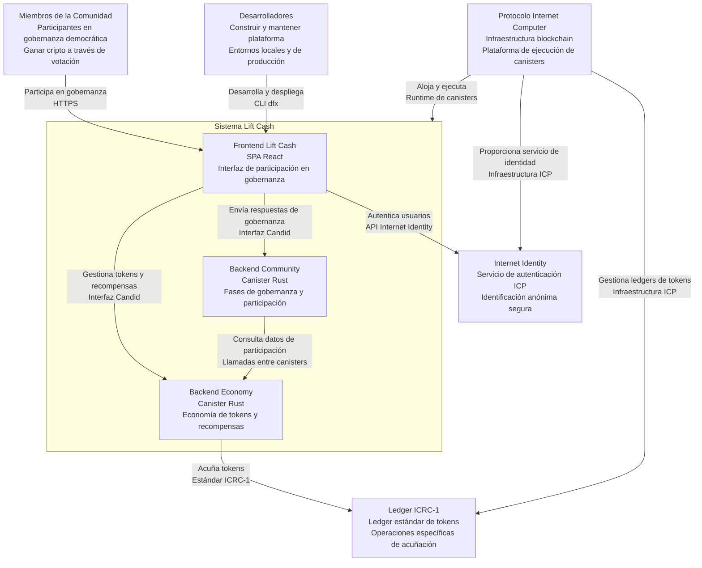
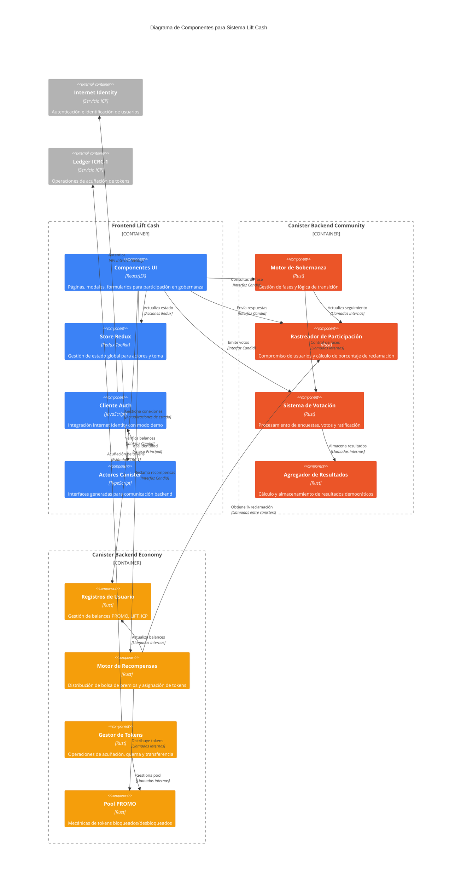
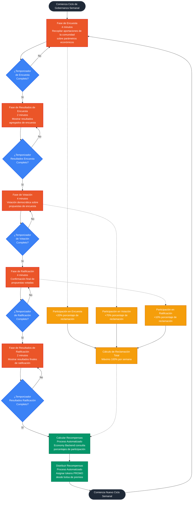
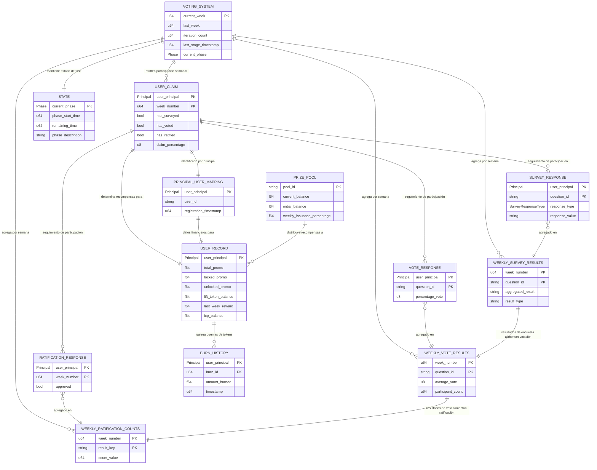
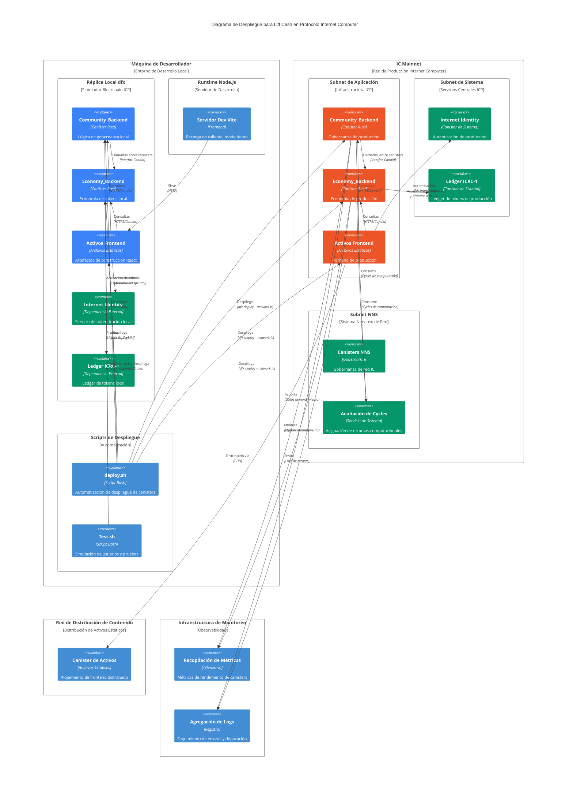

# Arquitectura del Sistema Lift Cash

## ⚠️ Aviso de Fase de Prototipo

**Esta documentación describe la implementación actual del prototipo de Lift Cash. Muchos valores y plazos están configurados con fines de prueba y serán diferentes en producción:**

- **Plazos de Prueba**: Las fases de gobernanza actualmente duran 4-6 minutos cada una (en lugar de días/semanas) para prototipado rápido y pruebas
- **Cantidades de Tokens**: La bolsa de premios de 10,000 tokens es un valor de prueba para prototipo, no los parámetros económicos finales
- **Ratios Económicos**: La división 50/50 bloqueado/desbloqueado y las tasas de desbloqueo del 15% son valores de prueba temporales
- **Porcentajes de Participación**: Los porcentajes de reclamación de Encuesta (20%), Voto (70%), Ratificación (10%) son valores de prototipo

**Los valores de producción se determinarán a través de la gobernanza comunitaria y modelado económico.**

## Visión General de la Arquitectura de Alto Nivel

Lift Cash es un **sistema económico cooperativo autogobernado** construido sobre el protocolo Internet Computer (ICP) que permite a los participantes gestionar democráticamente la política fiscal y ganar ingresos en criptomonedas a través de la participación en la gobernanza.

### Resumen de la Arquitectura del Sistema

El sistema sigue una **arquitectura multi-canister** con clara separación de responsabilidades:

- **Community_Backend (Rust)**: Gestiona flujos de trabajo de gobernanza democrática, transiciones de fases y seguimiento de participación de usuarios
- **Economy_Backend (Rust)**: Maneja registros financieros, economía de tokens, distribución de recompensas y gestión de balances entre canisters
- **Lift_Cash_frontend (React/TypeScript)**: Proporciona interfaz de usuario con gestión de estado Redux, autenticación Internet Identity y participación en gobernanza en tiempo real

### Componentes Principales y Responsabilidades

#### 1. Canister Community_Backend
- **Gestión del Ciclo de Vida de la Gobernanza**: Organiza ciclos de gobernanza semanales (Encuesta → Voto → Ratificación → Resultados)
- **Seguimiento de Participación**: Registra el compromiso de usuarios con porcentajes de reclamación (Encuesta: 20%, Voto: 70%, Ratificación: 10% - valores de prueba de prototipo)
- **Toma de Decisiones Democrática**: Agrega las aportaciones de la comunidad usando promedios para deslizadores y votos mayoritarios para opciones
- **Lógica de Transición de Fases**: Fases automatizadas de 4 minutos con períodos de resultados de 2 minutos (plazos de prueba de prototipo)

#### 2. Canister Economy_Backend
- **Gestión de Registros Financieros**: Mantiene balances de usuarios para tokens PROMO, LIFT e ICP
- **Economía de Tokens**: Implementa mecanismo PROMO 50/50 bloqueado/desbloqueado con 15% de desbloqueo por participación (ratios de prueba de prototipo)
- **Distribución de Recompensas**: Distribuye desde la bolsa de premios (10,000 tokens - cantidad de prueba de prototipo) basado en la participación en la gobernanza
- **Integración Entre Canisters**: Llama a Community_Backend para recuperar porcentajes de reclamación de usuarios para cálculos de recompensas

#### 3. Frontend React
- **Gestión de Estado**: Redux Toolkit con actorsSlice (conexiones a canisters) y themeSlice (modo oscuro)
- **Autenticación**: Integración con Internet Identity con modo demo configurable para desarrollo
- **Actualizaciones en Tiempo Real**: Transiciones de fases en vivo con temporizadores de cuenta regresiva y actualizaciones dinámicas de UI
- **Diseño Responsivo**: Tailwind CSS mobile-first con variables CSS personalizadas para temas consistentes

### Interacciones del Sistema

#### Flujo de Comunicación Entre Canisters
1. **Frontend ↔ Community_Backend**: Enviar respuestas de gobernanza, obtener estado de fases y datos de participación
2. **Frontend ↔ Economy_Backend**: Recuperar registros financieros, iniciar operaciones de tokens, verificar elegibilidad de recompensas
3. **Economy_Backend → Community_Backend**: Consultar porcentajes de participación de usuarios para distribución automática de recompensas

#### Flujo de Trabajo de Gobernanza
```
Ciclo Semanal: Encuesta (4min) → Resultados Encuesta (2min) → Voto (4min) → Ratificación (4min) → Resultados Ratificación (2min) → Distribución de Recompensas → Nueva Semana
(Plazos de prueba de prototipo - la producción usará períodos más largos)
```

#### Modos de Desarrollo
- **Modo Demo** (`DEMO_MODE = true`): Desarrollo solo frontend con autenticación simulada y actores de canister
- **Modo Completo** (`DEMO_MODE = false`): Integración ICP completa con canisters reales y operaciones blockchain

### Arquitectura de Economía de Tokens

#### Sistema de Tres Tokens
- **PROMO**: Token de recompensa principal con mecanismo de bloqueo (50% bloqueado inicialmente, se desbloquea basado en participación - ratios de prueba de prototipo)
- **LIFT**: Token de gobernanza y utilidad para operaciones del sistema
- **ICP**: Token nativo de Internet Computer para integración del ecosistema

#### Arquitectura de Implementación de Tokens
- **Token PROMO**: Solo sistema de balance interno (NO cumple con ICRC-1)
  - Almacenado como campos `f64` en registros de usuario del Economy_Backend
  - Gestionado a través de funciones internas del canister
  - Soporta mecánicas complejas de bloqueo/desbloqueo para participación en gobernanza
  - Sin integración con estándares de tokens blockchain externos
- **Token LIFT**: Token blockchain completamente compatible con ICRC-1
  - Despliegue completo de canister ledger ICRC-1/ICRC-2 con funcionalidad estándar
  - Seguimiento de balance interno en registros de usuario para operaciones del sistema y rendimiento
  - ID del canister ledger ICRC-1 externo: `ss2fx-dyaaa-aaaar-qacoq-cai`
  - Soporta integración estándar con billeteras, transferencias usuario-a-usuario y todas las operaciones ICRC
- **Token ICP**: Token blockchain externo con integración estándar de billetera ICP

#### Mecánicas Económicas
- **Gestión de Bolsa de Premios**: Bolsa de 10,000 tokens (cantidad de prueba de prototipo) con porcentaje de emisión semanal determinado por gobernanza
- **Recompensas por Participación**: Distribución proporcional basada en niveles de compromiso con la gobernanza
- **Distribución Automática**: Cálculo de recompensas entre canisters y transferencia de tokens después de cada ciclo

#### Integración de Operaciones de Tokens
- **Integración ICRC-1**: Alcance limitado - usado solo para operaciones específicas de acuñación de tokens vía canister ledger codificado (ss2fx-dyaaa-aaaar-qacoq-cai)
- **Sistema de Balance Interno**: Distribución principal de recompensas y transferencias de tokens manejadas a través de la gestión de balance interno del Economy Backend
- **Soporte Multi-Token**: Balances de tokens PROMO, LIFT e ICP mantenidos dentro del estado del canister

## Diagramas UML Mermaid de Fase de Prototipo

**📋 Aviso de Valores de Diagramas**: Todos los valores numéricos, plazos y porcentajes mostrados en los diagramas a continuación son valores de prueba de prototipo únicamente. Los valores de producción se determinarán a través de la gobernanza comunitaria.

Basándose en el análisis de arquitectura del sistema, los siguientes diagramas Mermaid serían más efectivos para explicar el sistema Lift Cash a nuevos desarrolladores y partes interesadas:

### 1. Diagramas de Arquitectura del Sistema

#### **Diagrama de Contexto C4**
- **Propósito**: Mostrar límites del sistema de alto nivel y actores externos
- **Contenido**: Usuarios, Internet Identity, blockchain ICP, sistemas externos, y el límite del sistema Lift Cash
- **Audiencia**: Partes interesadas ejecutivas, gerentes de producto, arquitectos de sistemas



#### **Diagrama de Componentes**
- **Propósito**: Ilustrar componentes principales del sistema y sus relaciones
- **Contenido**: Frontend, Community_Backend, Economy_Backend, y sus interfaces
- **Audiencia**: Arquitectos técnicos, desarrolladores senior



### 2. Diagramas de Procesos de Gobernanza

#### **Diagrama de Flujo: Ciclo de Vida de la Gobernanza**
- **Propósito**: Visualizar el flujo completo de trabajo de gobernanza desde Encuesta hasta Resultados
- **Contenido**: Transiciones de fases, puntos de decisión y procesos automatizados
- **Audiencia**: Propietarios de producto, participantes en gobernanza, partes interesadas del negocio



### 3. Diagramas de Datos e Integración

#### **Diagrama de Relación de Entidades: Modelo de Datos**
- **Propósito**: Mostrar estructuras de datos y relaciones entre entidades
- **Contenido**: UserRecord, PhaseData, GovernanceResults, y sus relaciones
- **Audiencia**: Desarrolladores backend, diseñadores de bases de datos, analistas de datos



### 4. Diagramas de Implementación Técnica

#### **Diagrama de Despliegue: Infraestructura ICP**
- **Propósito**: Mostrar arquitectura de despliegue en Internet Computer
- **Contenido**: Canisters, réplica local, IC mainnet, y entornos de desarrollo
- **Audiencia**: Ingenieros DevOps, desarrolladores blockchain, equipo de infraestructura



### 5. Diagramas de Procesos de Negocio

#### **Diagrama de Flujo de Economía de Tokens**
- **Propósito**: Visualizar el ciclo de vida de tokens y mecanismos económicos
- **Contenido**: Acuñación de tokens, bloqueo/desbloqueo, distribución de recompensas, y quema
- **Audiencia**: Diseñadores de tokenomics, analistas financieros, economistas de cripto

```mermaid
flowchart TD
    %% Inicialización de Bolsa de Premios
    Start([Inicialización del Sistema]) --> PrizePool[Bolsa de Premios Creada<br/>Balance Inicial: 10,000 PROMO<br/>Emisión Semanal: Porcentaje Determinado por Gobernanza]
    
    %% Ciclo de Gobernanza Semanal
    PrizePool --> WeekStart[Comienza Nueva Semana de Gobernanza<br/>Reiniciar seguimiento de participación<br/>Calcular emisión semanal]
    
    WeekStart --> WeeklyIssuance[Calcular Distribución Semanal<br/>Cantidad = Bolsa de Premios * Porcentaje Votado por Gobernanza<br/>Tasa de emisión determinada por voto comunitario]
    
    %% Participación de Usuario y Acumulación de Reclamaciones
    WeeklyIssuance --> UserParticipation{¿Usuario Participa<br/>en Gobernanza?}
    
    UserParticipation -->|Encuesta| SurveyReward[Participación en Encuesta<br/>+20 por ciento reclamación<br/>Registro en Community Backend]
    UserParticipation -->|Voto| VoteReward[Participación en Votación<br/>+70 por ciento reclamación<br/>Registro en Community Backend]
    UserParticipation -->|Ratificación| RatifyReward[Participación en Ratificación<br/>+10 por ciento reclamación<br/>Registro en Community Backend]
    UserParticipation -->|Sin Participación| NoReward[Sin Porcentaje de Reclamación<br/>0 por ciento elegibilidad de recompensa<br/>Esperar a la próxima semana]
    
    SurveyReward --> ClaimCalc[Calcular Reclamación Total<br/>Máximo 100 por ciento por semana<br/>Encuesta + Voto + Ratificación]
    VoteReward --> ClaimCalc
    RatifyReward --> ClaimCalc
    
    %% Distribución de Recompensas al Final de la Semana
    ClaimCalc --> WeekEnd[Fin de Semana Activado<br/>Distribución automática de recompensas<br/>Comunicación entre canisters]
    NoReward --> WeekEnd
    
    WeekEnd --> IndividualReward[Calcular Recompensa Individual<br/>Recompensa Usuario = Emisión Semanal * Porcentaje Reclamación dividido por 100<br/>Recompensa basada en emisión determinada por gobernanza]
    
    %% Mecanismo de División de Tokens
    IndividualReward --> TokenSplit[Dividir Recompensa 50/50<br/>50% PROMO bloqueado<br/>50% PROMO desbloqueado]
    
    %% Gestión de Tokens Bloqueados
    TokenSplit --> LockedTokens[Agregar a Balance Bloqueado<br/>Almacenamiento Economy Backend<br/>No se puede transferir]
    
    %% Gestión de Tokens Desbloqueados
    TokenSplit --> UnlockedTokens[Agregar a Balance Desbloqueado<br/>Almacenamiento Economy Backend<br/>Disponible para uso]
    
    %% Desbloqueo Basado en Participación
    LockedTokens --> UnlockCheck{¿Participación<br/>Semana Actual?}
    UnlockCheck -->|Sí| UnlockCalc[Calcular Cantidad de Desbloqueo<br/>15 por ciento del balance bloqueado<br/>Bono de participación]
    UnlockCheck -->|No| StayLocked[Tokens Bloqueados Permanecen<br/>Sin desbloqueo sin participación<br/>Incentivo para mantenerse activo]
    
    UnlockCalc --> UnlockTransfer[Transferir 15 por ciento Bloqueado a Desbloqueado<br/>Actualizar balances de usuario<br/>Operación Economy Backend]
    
    %% Utilización de Tokens
    UnlockedTokens --> TokenUse{Opciones de Uso<br/>de Tokens}
    UnlockTransfer --> TokenUse
    
    TokenUse -->|Transferir| TokenTransfer[Transferir a Otros Usuarios<br/>Sistema de balance interno<br/>Transacciones peer-to-peer]
    TokenUse -->|Mantener| TokenHold[Mantener en Balance<br/>Acumular con el tiempo<br/>No se requiere acción]
    TokenUse -->|Quemar| TokenBurn[Quemar Tokens<br/>Remover de circulación<br/>Presión deflacionaria]
    
    %% Gestión de Bolsa de Premios
    IndividualReward --> PoolDeduction[Deducir de Bolsa de Premios<br/>Nuevo Balance = Actual - Distribuido<br/>Cantidad varía según voto de gobernanza]
    
    PoolDeduction --> PoolReplenish{¿Auto-reposición<br/>Habilitada?}
    PoolReplenish -->|Sí| MintNew[Acuñar Nuevos Tokens<br/>Operación ledger ICRC-1<br/>Restaurar balance de bolsa]
    PoolReplenish -->|No| PoolDepleted[Bolsa de Premios Disminuye<br/>Presión deflacionaria natural<br/>Escasez aumenta]
    
    MintNew --> PoolRestore[Restaurar Bolsa de Premios<br/>Reponer a balance objetivo<br/>Economía de tokens sostenible]
    
    %% Economía Multi-Token
    TokenTransfer --> MultiToken[Sistema Multi-Token<br/>PROMO: Sistema de balance interno<br/>LIFT: Token blockchain ICRC-1 completo<br/>ICP: Token blockchain externo]
    
    MultiToken --> PROMOToken[Balance Token PROMO<br/>Almacenamiento f64 interno<br/>Mecánicas bloqueado/desbloqueado<br/>NO estándar ICRC-1]
    MultiToken --> LIFTToken[Balance Token LIFT<br/>Cumplimiento completo ICRC-1/ICRC-2<br/>Token blockchain estándar<br/>Integración con billeteras soportada]
    MultiToken --> ICPToken[Balance Token ICP<br/>Integración blockchain completa<br/>Tarifas de red<br/>Operaciones cross-chain]
    
    %% Ciclos Económicos y Retroalimentación
    StayLocked --> NextWeek[Siguiente Semana de Gobernanza<br/>Oportunidad para participación<br/>Potencial de desbloqueo permanece]
    TokenHold --> NextWeek
    PoolDepleted --> NextWeek
    PoolRestore --> NextWeek
    LIFTToken --> NextWeek
    ICPToken --> NextWeek
    
    NextWeek --> WeekStart
    
    %% Economía de Quema de Tokens
    TokenBurn --> BurnRecord[Registrar Transacción de Quema<br/>Actualizar historial de quema<br/>Remoción permanente de tokens]
    BurnRecord --> DeflatEffect[Efecto Deflacionario<br/>Reducir suministro total<br/>Incrementar valor de escasez]
    DeflatEffect --> NextWeek

    %% Estilos para diferentes flujos económicos
    classDef poolFlow fill:#059669,stroke:#047857,stroke-width:2px,color:white
    classDef rewardFlow fill:#eb5528,stroke:#dc2626,stroke-width:2px,color:white
    classDef tokenFlow fill:#f59e0b,stroke:#d97706,stroke-width:2px,color:white
    classDef burnFlow fill:#dc2626,stroke:#b91c1c,stroke-width:2px,color:white
    classDef decision fill:#3b82f6,stroke:#2563eb,stroke-width:2px,color:white

    class PrizePool,WeeklyIssuance,PoolDeduction,PoolReplenish,MintNew,PoolRestore,PoolDepleted poolFlow
    class SurveyReward,VoteReward,RatifyReward,ClaimCalc,IndividualReward,TokenSplit rewardFlow
    class LockedTokens,UnlockedTokens,UnlockTransfer,TokenTransfer,TokenHold,MultiToken,LIFTToken,ICPToken tokenFlow
    class TokenBurn,BurnRecord,DeflatEffect burnFlow
    class UserParticipation,UnlockCheck,TokenUse,PoolReplenish decision
```

